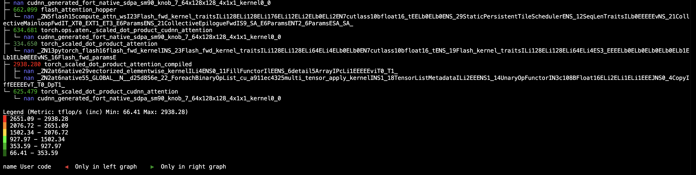
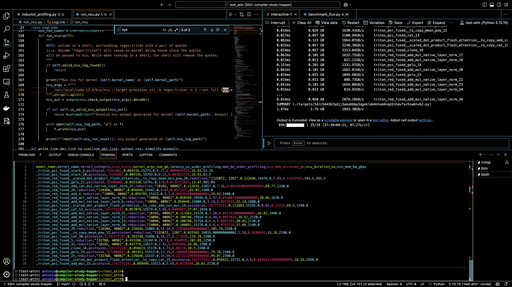

# Attention experimentation

A set of different attention operator implementations used evaluate the performance of its kernels and its integration with PyTorch. We leverage new native Triton profiler, [Proton](https://github.com/triton-lang/triton/tree/main/third_party/proton), which provide a lightweight mechanism for gathering crucial kernel benchmarking metric information such as:

- TFLOP/s
- Execution time
- Memory-bandwidth
- Line-level Triton kernel information
- Kernel metadata

Torch `scaled_dot_product_attention` different [backends](https://github.com/pytorch/pytorch/blob/612122af8f4b386bf5c8cc45164a26f26799903d/torch/nn/attention/__init__.py#L30) (e.g. `CUDN_BACKEND`) benchmarking compared to FlashAttention v3 Hopper. See [test/test_sdpa_cudnn.py](https://github.com/ai-compiler-study/test_attn/blob/main/test/test_sdpa_cudnn.py). We can verify the the performance is almost identical and they generate the same CUDA kernel: `cudnn_generated_fort_native_sdpa_sm90_knob_7_64x128x128_4x1x1_kernel_0_0`



Future plans for **Proton:** annotate kernels generated by torch.compile so that [**flops**](https://github.com/triton-lang/triton/blob/04f87d021a3550aa536862aecee21bf0a30a2452/third_party/proton/tutorials/matmul.py#L269) and **bytes** can be obtained even for these automatically generated kernels (see codegen and [TritonTemplate](https://github.com/pytorch/pytorch/blob/419a7e197d2579e699c2e730902d197a27df8deb/torch/_inductor/select_algorithm.py#L675)). Generally, the user does not know this information because, in this case, the TorchInductor compiler is the one that "wrote" these kernels. (see [Jokeren https://github.com/pytorch/pytorch/pull/136169#issuecomment-2375287772](https://github.com/pytorch/pytorch/pull/136169#issuecomment-2375287772))

We also include several small util experimental scripts to **automatically profiling** [Torch Inductor GPU kernels](https://github.com/ai-compiler-study/test_attn/blob/main/inductor_profiling.py). Our main reference, [PyTorch team example notebooks](https://colab.research.google.com/drive/1XQwio7DsqB5LP2D574f_uIb8G7KhirNa?usp=sharing#scrollTo=P5sS86KpdaTI). Considerations:

- **Sudo privileges for NCU execution:** currently our workaround is a mere manual [hard-coded path](https://github.com/ai-compiler-study/test_attn/blob/eafb7e42a13127d59fbf18e5269da33decc04e66/run_ncu.py#L170).

Example output for **FLUX** DiT model:


# Installation

**Pre-requisites:**

- Linux x86_64
- CUDA 12.0+ for Hopper and CUDA 12.1+ for Ada
- NVIDIA Driver supporting CUDA 12.0 or later
- cuDNN 8.1 or later
- For fused attention, CUDA 12.1 or later, NVIDIA Driver supporting CUDA 12.1 or later, and cuDNN 8.9 or later.

## Docker

We recommend using a Docker dev container for the formal reproducibility of the benchmarking results. We provide a Dockerfile which could be build as:

```bash
$ docker build -t test-attn-h100-dev:latest -f docker/tritonbench-nightly.dockerfile .
```

Then to run the container in interactive session:
```bash
$ docker run -it -d --net host --shm-size=2g --ulimit memlock=-1 --ulimit stack=67108864 --runtime=nvidia --gpus all --name <container_name> <docker_image>

docker exec -it triton_server /bin/bash
```

# xFormers: FlashAttention 3 Torch Custom Operator

[Torch Custom Operators Manual](https://docs.google.com/document/d/1_W62p8WJOQQUzPsJYa7s701JXt0qf2OfLub2sbkHOaU/edit#heading=h.ptttacy8y1u9) states that for external CUDA kernels to have integration with Torch subsystems, such as Torch compiler, we need to provide the correspondent wrapping logic on top, to avoid **graphs-breaks** and increase **optimization space**. We have found a [problem originated in the latest updates of FlashAttention](https://github.com/pytorch-labs/tritonbench/issues/20) that breaks the existing [xformers flash3 operator integration](https://github.com/facebookresearch/xformers/blob/6e10bd21ac6fc878657b24684723ccd05e41d385/xformers/ops/fmha/flash3.py#L56). We modify xformers `setup.py` with `libraries=["cuda"]` patch as [temporal workaround](https://github.com/facebookresearch/xformers/pull/1157) until upstream FA3 fix and upgrade CUTLASS

# NVIDIA TransformerEngine

Currently it’s importing FlashAttention 3 as follows:

```python
from flashattn_hopper.flash_attn_interface import flash_attn_func as flash_attn_func_v3
```

What raises the error `ModuleNotFoundError: No module named 'flashattn_hopper'`. We don’t understand why the official import convention is not used instead, which we employ in this repo:

```python
from hopper.flash_attn_interface import flash_attn_func as flash_attn_func_hopper
```

Due to this issue, we have decided to avoid TransformerEngine installation as optional. In case using this implementation is crucial, we recommend the following [from source installation](https://docs.nvidia.com/deeplearning/transformer-engine/user-guide/installation.html#installation-from-source):

```bash
# Clone repository, checkout stable branch, clone submodules*

git clone --branch stable --recursive https://github.com/NVIDIA/TransformerEngine.git

cd TransformerEngine

export NVTE_FRAMEWORK=pytorch  *# Optionally set framework*

pip install .          *# Build and install*
```